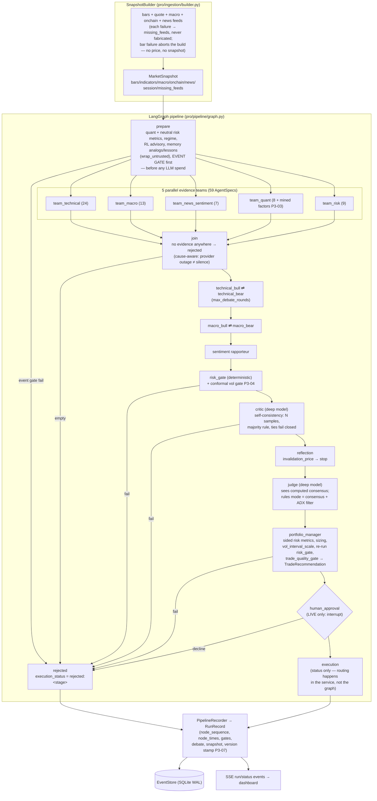
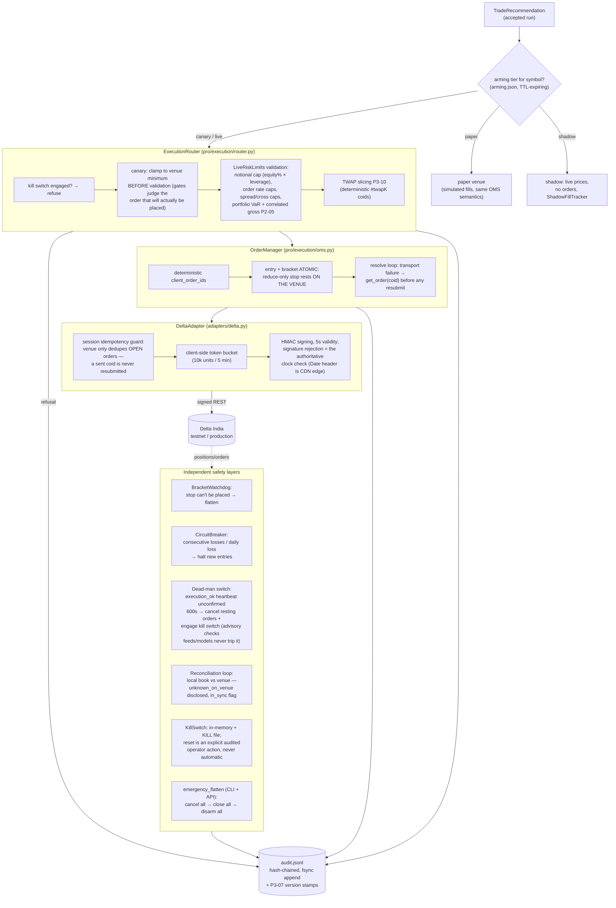
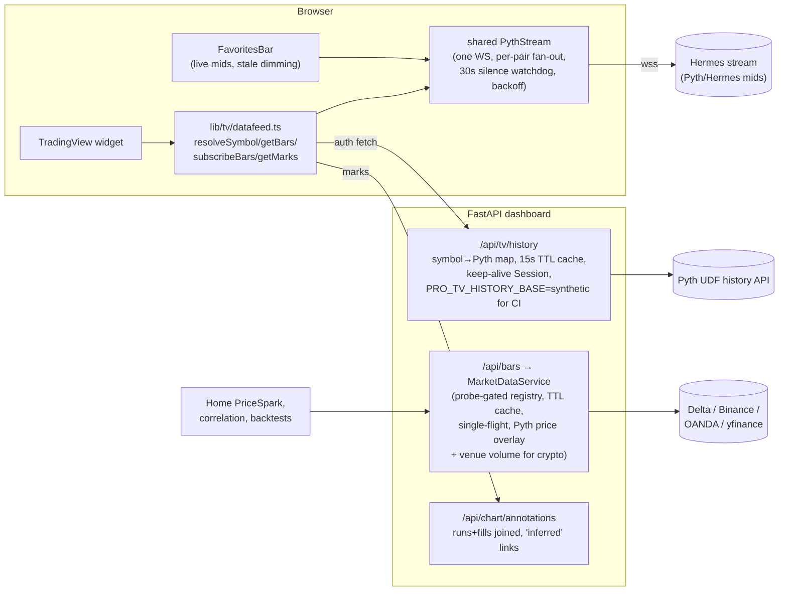
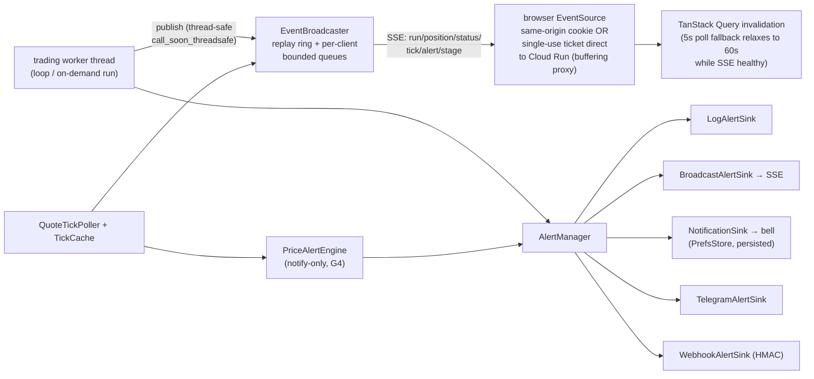
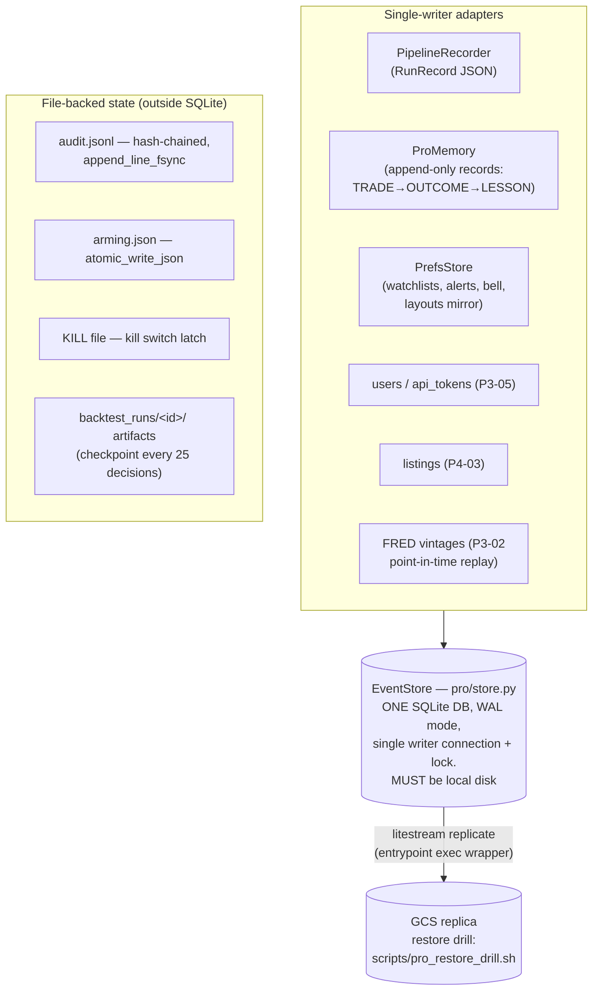
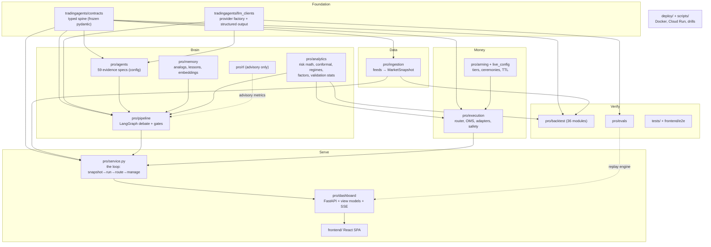

# TradingAgents Pro — Architecture, Data Flow & Component Diagrams

> Regenerates the HLD/LLD diagrams lost to the iCloud incident (ADR-0013).
> Narrative history lives in [`ARCHITECTURE.md`](../../ARCHITECTURE.md); design
> decisions in [`DECISIONS.md`](../../DECISIONS.md); hands-on instructions in
> [`docs/DEVELOPER_GUIDE.md`](../DEVELOPER_GUIDE.md). Diagrams are Mermaid and
> render on GitHub.

---

## 1. System architecture

Two deployment shapes run the **same codebase** (`tradingagents.pro.main`):
the always-on **cloud paper deployment** (Cloud Run) and the **local armed
host** used for the P3-01 live dust pilot. Live order routing only exists
where an operator has run the arming ceremony — the cloud service never
holds venue trading keys.

```mermaid
flowchart TB
    subgraph Client["Operator's browser"]
        SPA["React SPA<br/>(Vite build, PWA)"]
        TV["TradingView widget<br/>(same-origin iframe,<br/>mirrored /charting_library/)"]
        SPA --- TV
    end

    subgraph GCP["Google Cloud"]
        FB["Firebase Hosting<br/>rewrite ** → Cloud Run"]
        subgraph CR["Cloud Run: pro-dashboard (PAPER)"]
            direction TB
            LS["Litestream<br/>(entrypoint -exec wrapper)"]
            APP1["uvicorn ×1 worker<br/>FastAPI dashboard + hourly paper loop<br/>(single process — SSE broadcaster,<br/>session store, SQLite writer)"]
            LS --> APP1
        end
        STG["Cloud Run: pro-dashboard-staging<br/>(scale-to-zero, loop disabled,<br/>deploy smoke-gate only)"]
        GCS[("GCS buckets<br/>/data volume + litestream replica")]
        SM["Secret Manager<br/>(LLM keys, dashboard token,<br/>FRED, Telegram)"]
        FB --> APP1
        APP1 <--> GCS
        SM --> APP1
    end

    subgraph Local["Local armed host (P3-01 dust pilot)"]
        LOOP["python -m tradingagents.pro.main<br/>under caffeinate, PORT 8600<br/>live.yaml + arming.json + KILL file"]
        ENV[".env (0600, operator-typed)<br/>DELTA_TESTNET keys, PRO_LIVE_CONFIG"]
        ENV --> LOOP
    end

    subgraph Vendors["Market data vendors (free-first)"]
        PYTH["Pyth UDF history<br/>thefundedroom.com/api/pyth/history"]
        HERMES["Hermes price stream<br/>wss://datafeeds-590z.onrender.com"]
        DELTA["Delta Exchange India<br/>testnet + production"]
        OTHERS["Binance · OANDA · FRED ·<br/>CoinMetrics · Deribit · Yahoo ·<br/>alternative.me · CFTC · Goldhub CSV"]
    end

    subgraph LLM["LLM providers"]
        PROV["groq / deepseek / openai / xai / google …<br/>(OpenAI-compatible registry)"]
        CLI["claude-cli<br/>(subscription via local login or<br/>CLAUDE_CODE_OAUTH_TOKEN headless)"]
    end

    subgraph Alerts["Alert sinks"]
        TG["Telegram"]
        WH["Webhooks (HMAC X-Pro-Signature)"]
    end

    SPA -->|"HTTPS /api/* (X-API-Key + cookie)"| FB
    SPA -->|"SSE (ticketed direct or same-origin)"| APP1
    SPA -->|"WSS ticks (browser-direct, no CORS on WS)"| HERMES
    APP1 -->|"/api/tv/history proxy (TTL cache)"| PYTH
    APP1 -->|read-only market data| OTHERS
    APP1 --> PROV & CLI
    APP1 --> TG & WH
    LOOP -->|"signed REST (token bucket)"| DELTA
    LOOP --> PROV & CLI
    LOOP -->|read-only market data| OTHERS
    SPA -.->|"operator drives localhost:8600<br/>when campaign runs locally"| LOOP
```

**Load-bearing constraints**

| Constraint | Why | Enforced at |
|---|---|---|
| Single uvicorn worker | in-process SSE broadcaster, session store, and the SQLite single-writer all live in one process | `deploy/Dockerfile.pro` CMD |
| SQLite on local disk, never GCS FUSE | FUSE cannot hold SQLite locks; durability comes from Litestream replication instead | `store.default_db_path()` → `/tmp/pro.db` in the image |
| Live keys only on the armed host | cloud is paper-only; `arm-live` is an interactive CLI ceremony with a typed confirmation phrase | `pro/cli.py`, `pro/arming.py` |
| Staging always loop-disabled | one accrual clock; no duplicate paper orders | `scripts/deploy_cloud_run.sh` |
| TradingView library mirrored same-origin | the widget iframe cannot be scripted cross-origin | `scripts/mirror_charting_library.py` → `frontend/public/charting_library/` |

---

## 2. Data-flow diagrams

### 2.1 Decision pipeline (one run)

A run is a LangGraph execution over `PipelineState`. Every rejection path is
an honest outcome; LLMs never override deterministic gates.

Abstention taxonomy (per agent): `NO_DATA` (honest coverage gap) vs
`LLM_ERROR` / `LLM_REFUSED` / `LLM_UNAVAILABLE` (model layer broken) — the
join node words its rejection differently for each, so a billing outage never
masquerades as "no signal".

### 2.2 Live order routing & the safety stack

### 2.3 Market data & charts

### 2.4 Events, alerts & UI state

### 2.5 Persistence

---

## 3. Component diagram & responsibilities

### 3.1 Foundation

| Component | Responsibility | Key symbols | Depends on → consumed by |
|---|---|---|---|
| `tradingagents/contracts/` | The typed spine every layer exchanges: frozen Pydantic v2 models, `extra="forbid"`, UTC-only. Live trading is structurally impossible unless `live_trading_enabled` AND `require_human_approval`. Side-aware trade geometry is validated at construction (BUY: stop < entry < TP ladder). | `MarketSnapshot`, `OHLCVBar`, `AgentEvidence` (≥1 data ref + attributed source), `TradeRecommendation`, `ProConfig`, `RiskLimits`, `LiveRiskLimits`, `Timeframe`, `AssetClass` | stdlib/pydantic → everything |
| `tradingagents/llm_clients/` | One factory over every provider; the universal seam is `with_structured_output(schema).invoke(prompt)` — anything satisfying it is substitutable (fakes, rules engine, anonymizer). `capabilities.py` is the single table of per-model quirks. | `create_llm_client`, `OpenAIClient` + `ProviderSpec` registry, `ClaudeCLIChat` (shells `claude -p`, JSON repair, env scrubbing), `get_capabilities`, `api_key_env.py` | contracts → pipeline, agents, evals |
| `pro/models.py` + `pro/observability.py` | Model routing (teams→quick, critic/reflection/judge→deep), pinned-model enforcement, cost/metrics wrapper. `llm_calls_total` counts successes only; failures land in `llm_failures_total` — the models health check reads both. | `ModelBundle.coerce`, `is_pinned_model`, `CostTrackingLLM`, `MetricsRegistry` (Prometheus text), `JsonFormatter` | llm_clients → service, health |

### 3.2 Data layer

| Component | Responsibility | Key symbols | Depends on → consumed by |
|---|---|---|---|
| `pro/ingestion/builder.py` | The single place feed failure is absorbed. Bars are load-bearing (failure aborts the build); everything else degrades into `missing_feeds` — disclosed, never fabricated. P3-02 vintage replay for as-of builds. | `SnapshotBuilder.build`, `build_gold_pipeline`, `build_bitcoin_pipeline` | feeds → service, backtest |
| Feed adapters (`binance` `delta_exchange` `oanda_gold` `gold_feeds` `gold_options` `positioning` `goldhub` `fred_macro` `econ_calendar` `onchain` `deribit` `liquidations` `news` `token_terminal` `pyth` `sessions`) | Typed contracts behind three Protocols (`BarsFeed`/`QuoteFeed`/`MetricsFeed`) with injectable transports; free-first per `docs/DATA_SOURCES.md`. `liquidations` is explicitly signal-grade (sampled; notionals are a floor). `pyth` gives one price series across asset classes with venue volume overlaid. | `RequestsTransport` (429→`VendorRateLimitError`), `LiquidationStream.shared_stream`, `PythPriceVenueVolumeFeed`, `PYTH_SYMBOLS` | base.py → builder, marketdata, intel |
| `pro/ingestion/indicators.py` | Deterministic indicator engine (stockstats + hand-rolled VWAP/OBV) with warm-up discipline. The UI renders these, never computes its own. | `compute_indicators`, `INDICATOR_SPECS` | bars → snapshots, `/api/bars/indicators` |

### 3.3 Decision brain

| Component | Responsibility | Key symbols | Depends on → consumed by |
|---|---|---|---|
| `pro/agents/` | Evidence layer: an agent **is** configuration (ADR-0014) — 59 `AgentSpec`s across 5 teams select snapshot slices; one shared `EvidenceAgent` runtime. LLM emits only `{claim, direction, confidence}`; attribution is attached by code from the rendered context (ADR-0015). Prompt-injection fencing via `wrap_untrusted`. Abstention taxonomy separates "no data" from "model broken". | `AgentSpec`, `EvidenceAgent`, `roster.py` (24 technical / 13 macro / 7 news / 8 quant / 9 risk), `render_context`, `ComputedFactorAgent` (P3-03), `GoldVolContextAgent` (P3-09) | contracts, llm_clients → pipeline |
| `pro/pipeline/` | The LangGraph debate graph (§2.1). Deterministic gates decide; LLMs argue. Critic runs self-consistency (majority of N, ties fail closed). Rules mode swaps the judge for deterministic consensus + ADX chop filter. Streaming updates feed the recorder and the live UI timeline. | `build_pro_pipeline`, `stream_pipeline`, `PipelineState`, `gates.py` (`risk_gate`, `trade_quality_gate`, `event_gate`, `conformal_vol_gate`), `schemas.py` (`DebateTurn`, `CriticReport`, `ReflectionNote`, `JudgeVerdict`), `qa.py` (ask-the-record) | agents, analytics, memory → service |
| `pro/memory/` | Append-only market memory: trades→outcomes→lessons, regime records, semantic retrieval (model2vec `potion-base-8M`, 256-dim, hashing fallback), knowledge graph of typed relations, win-stats for Kelly. Doubles as an audit trail. | `ProMemory`, `MemoryRecord`, `SemanticEmbedder`, `InMemoryVectorIndex` (+optional Qdrant, ADR-0020), `KnowledgeGraph` | store → pipeline prepare, service |
| `pro/analytics/` | Deterministic math the LLMs are never allowed to do: position sizing (fixed-risk, capped Kelly), VaR/CVaR + portfolio VaR (P2-05), invalidation/ATR stops, R-multiple ladders, HAR-RV + adaptive conformal intervals (P3-04), regime classification, factor language + IC (P3-03), overfitting stats (PSR/DSR/PBO, P2-02), crowding (P5-04), retro-scoring. | `risk.py`, `conformal.py`, `validation.py`, `factors.py`, `crowding.py`, `retro.py` | numpy/pandas → pipeline, execution, backtest |
| `pro/rl/` | RL advisor — **advisory only** (ADR-0025): produces metrics the prepare node includes as context; never sizes or gates. | `advisor`, `policy`, `trainer` | analytics → pipeline prepare |

### 3.4 Money path

| Component | Responsibility | Key symbols | Depends on → consumed by |
|---|---|---|---|
| `pro/execution/router.py` | Routes accepted recommendations by arming tier. Canary clamps to venue minimum BEFORE validation. Applies `LiveRiskLimits`, portfolio caps, TWAP slicing. Every refusal is an audited event. | `ExecutionRouter`, `_canary_sized`, `_submit_twap` | arming, validation, OMS → service |
| `pro/execution/oms.py` | Order lifecycle: deterministic coids, atomic entry+bracket (reduce-only stop rests on the venue), transport-failure resolve loop (`get_order` before resubmit), crash recovery from the journal. | `OrderManager` | adapters → router |
| `pro/execution/adapters/delta.py` | Delta India venue adapter: HMAC signing (5s validity), client-side token bucket, typed error taxonomy (network/5xx/429 transient vs semantic 4xx terminal), **session idempotency guard** (venue only dedupes open coids — proven live), instrument service (integer contracts, fail-closed on missing products), reads always available (arming gates orders, not reads). | `DeltaAdapter`, `SYMBOL_MAP`, `InstrumentService` | interface.py → OMS, drill, CLI |
| `pro/execution/safety.py`, `deadman.py`, `flatten.py` | The three kill-switch layers: (a) automated risk triggers (CircuitBreaker), (b) manual/file switch (`KILL`, reset is explicit + audited), (c) dead-man on `execution_ok` silence (cancels resting orders; never flattens positions — venue-side stops persist). `emergency_flatten` cancels+closes+disarms everything. | `KillSwitch`, `CircuitBreaker`, `DeadManSwitch`, `cancel_for_safety`, `emergency_flatten` | adapter → service, CLI, drill |
| `pro/arming.py` + `pro/live_config.py` + `pro/preflight.py` + `pro/cli.py` + `pro/drill.py` | Arming tiers (shadow→canary→live) with TTL expiry (silent demotion to paper); `live.yaml` loader refuses missing keys (no silent defaults for real capital; leverage >1 needs an explicit acknowledgment flag); readiness report; the interactive ceremonies (`arm-live`, `disarm`, `flatten`, `status`); the kill-switch drill (testnet-only, refuses unarmed pairs). | `ArmingStore`, `load_live_config`, `go_live_readiness`, `run_drill` | execution → operator |

### 3.5 Serving

| Component | Responsibility | Key symbols | Depends on → consumed by |
|---|---|---|---|
| `pro/service.py` | The production heartbeat: one iteration = snapshot → recorded pipeline run → route → manage open positions (bar-close stops/targets/breakeven/trailing, funding accrual) → report P&L to breaker + memory. `run_lock` serializes loop vs on-demand triggers. Event triggers (P2-06), TCA capture (P3-01), TWAP fills, restart rehydration (REL-01). `run_forever` never dies on iteration errors. | `PaperTradingService.run_once/run_forever`, `PipelineTrigger`, `check_event_triggers`, `rehydrate` | everything above → main.py |
| `pro/main.py` | Entrypoint: builds the service + dashboard state, wires staged live routing (armed pairs only), starts the loop thread + dead-man (execution-health heartbeat) + event-trigger daemon, serves uvicorn. Monitor mode when no LLM key (claude-cli counts a logged-in local CLI). | `main`, `build_service`, `_wire_staged_routing`, `has_llm_key` | service, dashboard → Docker/operator |
| `pro/dashboard/` | Thin FastAPI shell over tested view models (`service.py` view layer): auth (token + Google/Firebase → HttpOnly cookie, P3-05 roles), SSE broadcaster (thread-safe seam, replay ring, ticketed direct mode), market data + TV proxy, runs/timeline/evidence/diff/ask, journal/portfolio/risk/status, intel + calendar, backtest job engine (scripted + LLM with cost gate), prefs/watchlists/alerts/bell, track record (P4-02 public, rate-limited) + listings (P4-03 publish gate), users/tokens/webhooks, `/healthz` `/health/live` `/metrics`, SPA fallback (asset-like misses 404, never HTML-as-JS). | `create_app`, `EventBroadcaster`, `MarketDataService`, `PipelineRecorder`, `PrefsStore`, `IntelService`, `backtest_job.py` | service → frontend |
| `frontend/` | React SPA: 11 lazy routes inside `AppShell`/`AuthGate` (public track record outside), Zustand stores (ui/session/ticker/layout/drawings/live-progress), TanStack Query + Zod-validated API layer, one SSE connection with ticket fallback, TradingView terminal (mirrored library, custom datafeed: Pyth history via proxy + Hermes WS + AI marks), safety chrome that never moves (StatusStrip, banners), honesty primitives (`EmptyState` four states, sample-size thresholds, `Freshness`). | `routes.tsx`, `lib/api/{client,types,queries}`, `lib/sse.ts`, `lib/tv/*`, `features/*`, `components/*` | dashboard API → operator |

### 3.6 Verification & ops

| Component | Responsibility | Key symbols | Depends on → consumed by |
|---|---|---|---|
| `pro/backtest/` (36 modules) | The strategy lab: event-driven engine (decide close i, fill open i+1), broker with costs, walk-forward, optimization, Monte Carlo, meta-labeling, portfolio engine + allocator, 7 native strategies + presets/variants, HTML/PDF reports, LLM-pipeline replay with cost confirmation and per-decision funnel capture. | `engine.py`, `walkforward.py`, `presets.py`, `report_html.py` | ingestion, analytics, pipeline → dashboard jobs, scripts |
| `pro/evals/` | Pre-registered evaluation protocol (`docs/EVAL_PROTOCOL.md`): golden cases with forbidden actions, stability (pass^k), token-matched ablation (P1-02), memorization audit via anonymization (P2-03), rules baseline, graded-outcome corpus (P4-01, fine-tune gated at ≥200), factor mining (P3-03), crowding study (P5-04), quarterly self-assessment (P3-08). Ships in the package because the dashboard's replay uses `scripted.py`. | `harness.py`, `golden.py`, `stability.py`, `anonymize.py`, `rules.py`, `corpus.py` | pipeline → CI, operator |
| `tests/` + `frontend/e2e` | ~190 backend files (`test_pro_<area>.py`), hermetic conftest (fake keys, tmp data dir, live vendors disabled), shared fakes; the execution **conformance suite runs the same cases against the fake AND the real testnet** (caught the post-fill coid reuse double-fill live). Playwright e2e with `PRO_TV_HISTORY_BASE=synthetic` (zero egress). | `conftest.py`, `pro_fakes.py`, `test_pro_execution_conformance.py`, `terminal.spec.ts` | everything → CI |
| `deploy/` + `scripts/` | 4-stage Docker image (frontend build, deps, runtime + Litestream + claude CLI + baked embedder + git sha), staging→smoke→prod deploy script (cost shape: prod 1 vCPU warm singleton, staging scale-to-zero), kill-switch + restore drills, TV library mirror, strategy-lab and benchmark scripts, demo server. | `Dockerfile.pro`, `entrypoint-pro.sh`, `deploy_cloud_run.sh`, `pro_live_drill.sh`, `pro_restore_drill.sh`, `mirror_charting_library.py`, `pro_dashboard_demo.py` | — → GCP / operator |
