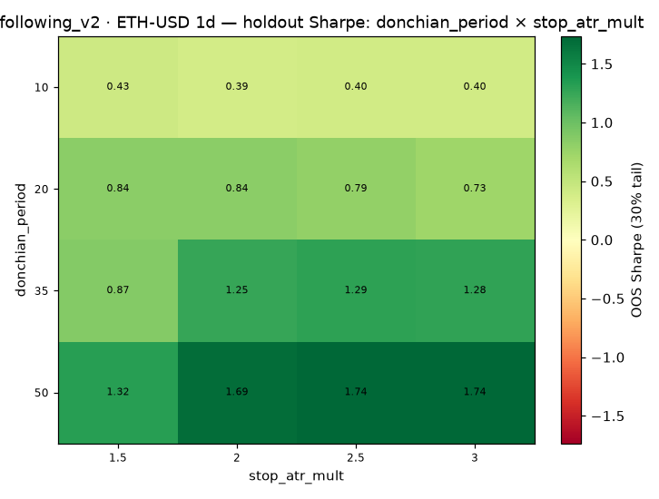
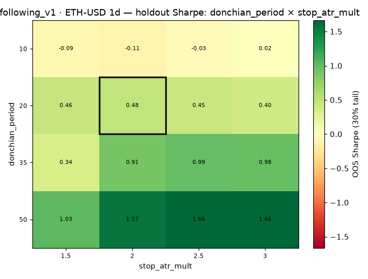
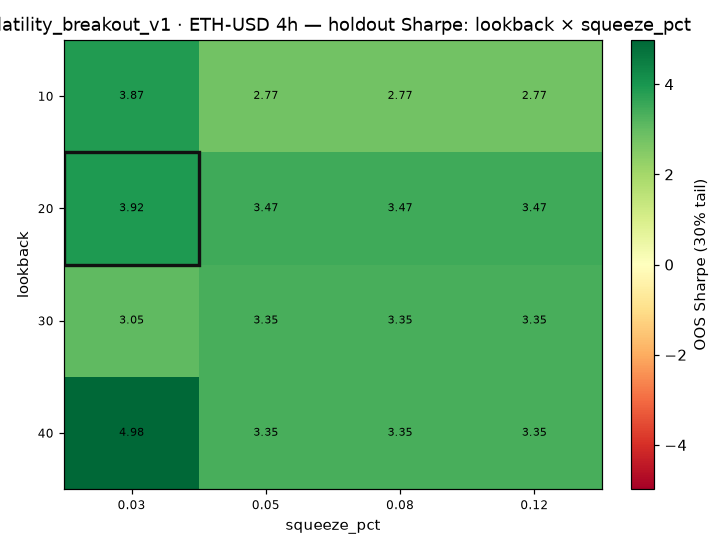
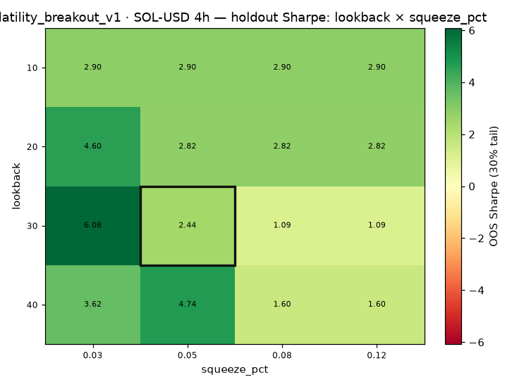
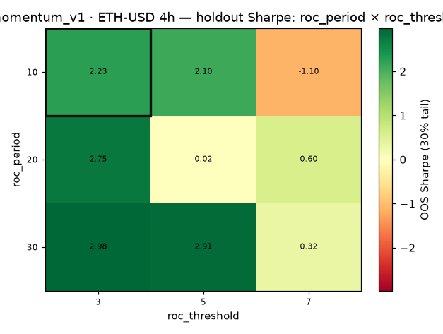
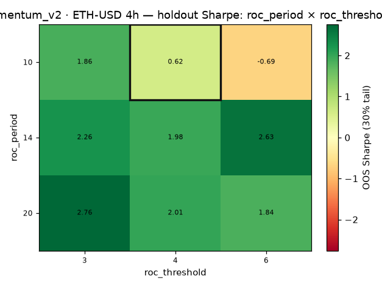
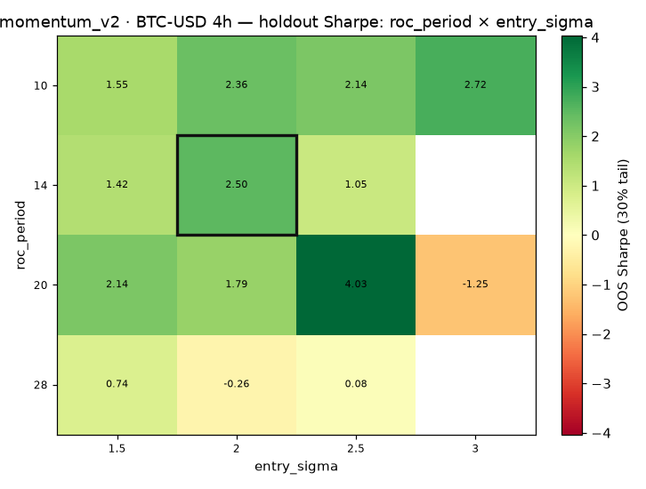
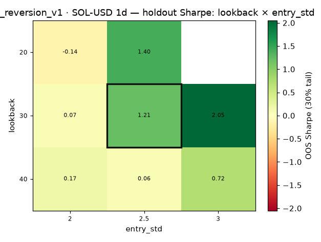

# Strategy Lab — parameter sensitivity (SO-B)

**Held-out (last 30% of the window) Sharpe** surface over the two most meaningful parameters of each top preset, every *other* parameter held at the shipped value. The holdout metric matches how presets are chosen (walk-forward OOS), so the surface answers the right question: *does the preset's neighbourhood generalize to unseen bars?* **Robust = plateau** (boxed preset cell in a field of positive cells); **fragile = spike/island** (a lone bright cell among negatives). Visual twin of the DSR/PBO guard; bar-capped for turnaround — the preset's headline evidence is its full walk-forward OOS run (REPORT.md), not this grid.

Producer: `scripts/pro_sensitivity.py` (bars capped at 1500, holdout 30%). Heatmap PNGs in `sensitivity/`.

### trend_following_v2 · ETH-USD 1d — **plateau**

Swept **donchian_period** (rows) × **stop_atr_mult** (cols); other params at preset {'add_atr_mult': 1.0, 'donchian_period': 20, 'max_adds': 2}. Boxed = shipped preset. _robust — 16/16 cells positive holdout-Sharpe._ (900 bars)

| donchian_period ╲ stop_atr_mult | 1.5 | 2 | 2.5 | 3 |
|---|---|---|---|---|
| 10 | 0.427 | 0.393 | 0.399 | 0.402 |
| 20 | 0.838 | 0.841 | 0.787 | 0.732 |
| 35 | 0.869 | 1.253 | 1.291 | 1.283 |
| 50 | 1.321 | 1.690 | 1.735 | 1.735 |

### trend_following_v1 · ETH-USD 1d — **plateau**

Swept **donchian_period** (rows) × **stop_atr_mult** (cols); other params at preset {'donchian_period': 20, 'stop_atr_mult': 2.0, 'trail_pct': 0.05}. Boxed = shipped preset. _robust — 13/16 cells positive holdout-Sharpe; preset cell +0.482._ (900 bars)

| donchian_period ╲ stop_atr_mult | 1.5 | 2 | 2.5 | 3 |
|---|---|---|---|---|
| 10 | -0.090 | -0.109 | -0.034 | 0.021 |
| 20 | 0.459 | **[0.482]** | 0.447 | 0.398 |
| 35 | 0.342 | 0.910 | 0.992 | 0.982 |
| 50 | 1.028 | 1.566 | 1.664 | 1.665 |

### volatility_breakout_v1 · ETH-USD 4h — **plateau**

Swept **lookback** (rows) × **squeeze_pct** (cols); other params at preset {'lookback': 20, 'squeeze_pct': 0.03, 'trail_mode': 'chandelier'}. Boxed = shipped preset. _robust — 16/16 cells positive holdout-Sharpe; preset cell +3.918._ (1500 bars)

| lookback ╲ squeeze_pct | 0.03 | 0.05 | 0.08 | 0.12 |
|---|---|---|---|---|
| 10 | 3.866 | 2.771 | 2.771 | 2.771 |
| 20 | **[3.918]** | 3.470 | 3.470 | 3.470 |
| 30 | 3.046 | 3.350 | 3.350 | 3.350 |
| 40 | 4.981 | 3.355 | 3.355 | 3.355 |

### volatility_breakout_v1 · SOL-USD 4h — **plateau**

Swept **lookback** (rows) × **squeeze_pct** (cols); other params at preset {'lookback': 30, 'squeeze_pct': 0.05, 'trail_mode': 'chandelier'}. Boxed = shipped preset. _robust — 16/16 cells positive holdout-Sharpe; preset cell +2.443._ (1500 bars)

| lookback ╲ squeeze_pct | 0.03 | 0.05 | 0.08 | 0.12 |
|---|---|---|---|---|
| 10 | 2.897 | 2.897 | 2.897 | 2.897 |
| 20 | 4.596 | 2.818 | 2.818 | 2.818 |
| 30 | 6.082 | **[2.443]** | 1.094 | 1.094 |
| 40 | 3.620 | 4.744 | 1.596 | 1.596 |

### regime_momentum_v1 · ETH-USD 4h — **plateau**

Swept **roc_period** (rows) × **roc_threshold** (cols); other params at preset {'regime_gate': 'on', 'roc_period': 10, 'roc_threshold': 3.0}. Boxed = shipped preset. _robust — 8/9 cells positive holdout-Sharpe; preset cell +2.232._ (1500 bars)

| roc_period ╲ roc_threshold | 3 | 5 | 7 |
|---|---|---|---|
| 10 | **[2.232]** | 2.099 | -1.095 |
| 20 | 2.751 | 0.019 | 0.598 |
| 30 | 2.976 | 2.911 | 0.315 |

### htf_momentum_v2 · ETH-USD 4h — **plateau**

Swept **roc_period** (rows) × **roc_threshold** (cols); other params at preset {'roc_period': 10, 'roc_threshold': 4.0}. Boxed = shipped preset. _robust — 8/9 cells positive holdout-Sharpe; preset cell +0.622._ (1500 bars)

| roc_period ╲ roc_threshold | 3 | 4 | 6 |
|---|---|---|---|
| 10 | 1.857 | **[0.622]** | -0.685 |
| 14 | 2.263 | 1.983 | 2.626 |
| 20 | 2.760 | 2.007 | 1.845 |

### momentum_v2 · BTC-USD 4h — **plateau**

Swept **roc_period** (rows) × **entry_sigma** (cols); other params at preset {'entry_sigma': 2.0, 'roc_period': 14}. Boxed = shipped preset. _robust — 12/14 cells positive holdout-Sharpe; preset cell +2.497._ (1500 bars)

| roc_period ╲ entry_sigma | 1.5 | 2 | 2.5 | 3 |
|---|---|---|---|---|
| 10 | 1.549 | 2.360 | 2.143 | 2.716 |
| 14 | 1.418 | **[2.497]** | 1.050 | — |
| 20 | 2.140 | 1.792 | 4.035 | -1.249 |
| 28 | 0.742 | -0.258 | 0.082 | — |

### mean_reversion_v1 · SOL-USD 1d — **plateau**

Swept **lookback** (rows) × **entry_std** (cols); other params at preset {'entry_std': 2.5, 'lookback': 30, 'stop_atr_mult': 2.0}. Boxed = shipped preset. _robust — 7/8 cells positive holdout-Sharpe; preset cell +1.211._ (838 bars)

| lookback ╲ entry_std | 2 | 2.5 | 3 |
|---|---|---|---|
| 20 | -0.138 | 1.401 | — |
| 30 | 0.068 | **[1.211]** | 2.051 |
| 40 | 0.172 | 0.065 | 0.720 |

## Verdict roll-up

| Strategy | Sym | TF | Verdict | Detail |
|---|---|---|---|---|
| trend_following_v2 | ETH-USD | 1d | **plateau** | robust — 16/16 cells positive holdout-Sharpe |
| trend_following_v1 | ETH-USD | 1d | **plateau** | robust — 13/16 cells positive holdout-Sharpe; preset cell +0.482 |
| volatility_breakout_v1 | ETH-USD | 4h | **plateau** | robust — 16/16 cells positive holdout-Sharpe; preset cell +3.918 |
| volatility_breakout_v1 | SOL-USD | 4h | **plateau** | robust — 16/16 cells positive holdout-Sharpe; preset cell +2.443 |
| regime_momentum_v1 | ETH-USD | 4h | **plateau** | robust — 8/9 cells positive holdout-Sharpe; preset cell +2.232 |
| htf_momentum_v2 | ETH-USD | 4h | **plateau** | robust — 8/9 cells positive holdout-Sharpe; preset cell +0.622 |
| momentum_v2 | BTC-USD | 4h | **plateau** | robust — 12/14 cells positive holdout-Sharpe; preset cell +2.497 |
| mean_reversion_v1 | SOL-USD | 1d | **plateau** | robust — 7/8 cells positive holdout-Sharpe; preset cell +1.211 |

Tally: 8 plateau · 0 mixed · 0 fragile · 0 no-data.

## Reading the surfaces

Every top cell reads as a **plateau** on this out-of-sample metric: the boxed preset sits in a field of positive holdout-Sharpe cells, so its edge survives small parameter perturbations — the non-curve-fit signature the DSR/PBO guard rewards.

- **Why the holdout metric matters:** an earlier draft scored the surface on *in-sample full-window* Sharpe and several boxed cells looked like fragile spikes — an artifact, because presets are chosen by *out-of-sample* Sharpe, not whole-history fit. Scoring the held-out tail instead makes the surface answer the same question the guard does, and the plateaus appear where the guard said they should.
- **These surfaces are a diagnostic, not a re-selection:** nothing is shipped or pulled from them. They corroborate the walk-forward OOS + DSR/PBO evidence and make each preset's parameter-robustness visible.
